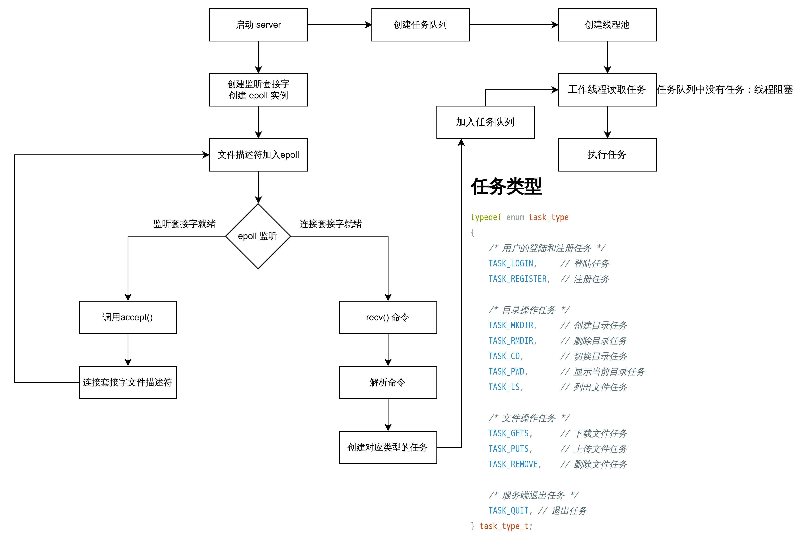

# 基于私有协议的文件管理服务器

## 项目概述

该项目是一个 C 语言和 Unix/Linux 系统编程初学者的练手项目。这是 C/S 架构的项目。本项目将涉及下列知识
+ C 语言
+ 网络编程
+ 文件操作
+ 线程
+ IO 多路复用
+ [tomlc99](https://github.com/cktan/tomlc99)：[TOML](https://toml.io/cn/) 文件解析库
+ [optparse](https://github.com/skeeto/optparse)：命令行选项解析库， `getopt()` 的可重入替代

## 服务段架构

服务端采用 **线程池架构**，其基本结构如下图

服务端主线程主要完成两个任务：**与客户端建立连接** 和 **读取客户端的指令**。为了能够完成这两项任务，这里我们需要使用 EPOLL

+ 首先，服务端创建 **监听套接字**(`sockfd`)，然后将其放入 EPOLL 实例中监听 **读就绪事件**
+ 当监听套接字上的读事件就绪时，有客户端发起连接。此时处理客户端的连接请求，从而获得一个 **连接套接字**(`connfd`)，然后将其放入 EPOLL 实例中监听 **读就绪事件** 和 **挂起事件**
+ 当 `connfd` 读就绪时，主线程读取指令并解析指令。然后产生一个任务并放入任务队列中

服务端入口在 [main.c](./server/main.c) 中

### 服务端配置管理

服务端需要知道其运行的 `hostname` 和 `port` 以及创建子线程的个数。如果将这三个参数硬编码在源码中是不合理的，因为每次修改都需要重新编译代码

我们将参数存储在一个文件中，然后让程序从文件中读取。这个文件称为 **配置文件**。这里我们采用 TOML 格式的文件作为项目的配置文件

### 任务队列

很显然最重要的结构就是 **任务队列**。任务队列中的元素是一个结构体，包含了发起该任务的 **CONNECTED SOCKET 文件描述符**、**任务类型** 和 **任务参数**。

这里我们将任务队列实现为一个环形队列。详细代码参考 [queue.h](./server/include/queue.h) 和 [queue.c](./server/src/queue.c)

### 线程池

线程池维护这所有线程的 **线程标识**，并关联一个任务队列。完整代码参考 [thread_pool.h](./server/include/thread_pool.h) 和 [thread_pool.c](./server/src/thread_pool.c)

每个线程在执行任务的适合会根据任务类型选择对应的函数进行调用。线程执行的函数定义在 [work.h](./server/include/work.h) 和 [work.c](./server/src/work.c) 中

### 服务端流程

主线程读取客户端发送的命令，解析命令并生成对应类型的任务。然后将任务放入任务队列中。工作线程从任务队列中读取任务，然后 **根据任务类型** 选择合适的函数执行。

下图展示了服务端的流程

## 客户端

## 功能实现

### 登陆

每个客户端登陆的用户可能不同，现阶段我们假设只有一个用户。并借用 Linux 的用户管理进行用户认证

